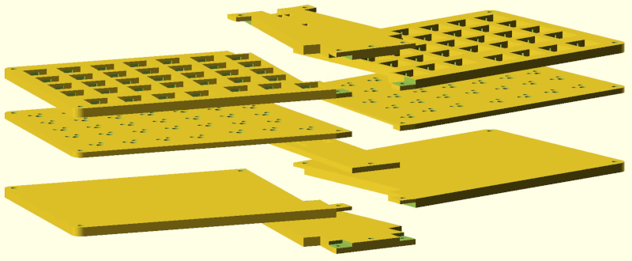

# TDPHSK :: 3D Printed Hot Swappable Keyboard

I've always wanted a keyboard with the ability to hot swap keycaps with my
custom layout. This is a proof of concept that uses a 3D printer to make all
the necessary parts to house the keyboard, and accomplish my goals!

The TDPHSK is a 70 key keyboard in a 14 by 5 grid. It has a split layout with a
slight angle to make it more comfortable to use. To make the switches hot
swappable, I'm fitting Kailh sockets in the 3D printed mid layer of the
keyboard. Below is a single key I've made to test the concept:

## Keyboard layers

The keyboard is comprised of 3 layers: *top*, *mid*, and *bottom*. Each layer
is subdivided in 3 more parts: *left*, *right*, and *center*. I did all these
subdivisions because of my printer's bed size. Here is an animation of all the
parts coming apart.

All the parts were designed in LibreCAD, in the
[keyboard-outline.dxf](keyboard-outline.dxf) file. Each layer of that file is
imported into the OpenSCAD file [3dkeeb.scad](3dkeeb.scad), and extruded to
make the 3D model.

To generate the STL files for 3D printing, just run `make`. All files shall be
created in the `renders` directory.

## Bill of materials

As this keyboard was made in Brazil, some of the materials are Brazilian only.

 * 1x STM32F401 microcontroller: [link](https://pt.aliexpress.com/item/4001049840288.html)
 * 70x 1N4148 diodes: [link](https://www.baudaeletronica.com.br/diodo-1n4148.html)
 * 70x Switches & Keycaps: anything compatible with the Kailh sockets
 * 70x Kailh Sockets: [link](https://pt.aliexpress.com/item/4001051840976.html)
 * 2m Insulated rigid cable: [link](https://www.baudaeletronica.com.br/cabo-rigido-vermelho-22-awg-0-30mm-por-metro.html)
 * 3D printed parts: see [renders](renders)

## Assembly

### Step 1: solder the diodes

Fit the sockets into their places and solder the diodes as shown. Try to be
quick so the plastic doesn't melt.

The 3D models were designed to have a very tight fit, if it is too dificult to
fit, try drilling the socket holes with a 3mm drill bit.

### Step 2: solder the columns

To solder the colums:

 1. Cut the wire to length;
 2. Align the end of the wire on the first key;
 3. Mark the position of the second key with a marker;
 4. Use your favorite method to cut the insulation; I usually use an stiletto;
 5. Pull the insulation by 1–2mm, and repeat the process.

There is a small gap between the wire and the socket, but it is very easy to
bridge the gap with the soldering iron. You should get something like this as a
result:

### Step 3: connect everything to the STM32

*TODO*

### Step 4: configure & compile QMK

*TODO*

# Copying

All the creative work and code portions of this project are licensed under the terms of GPL version 3.
